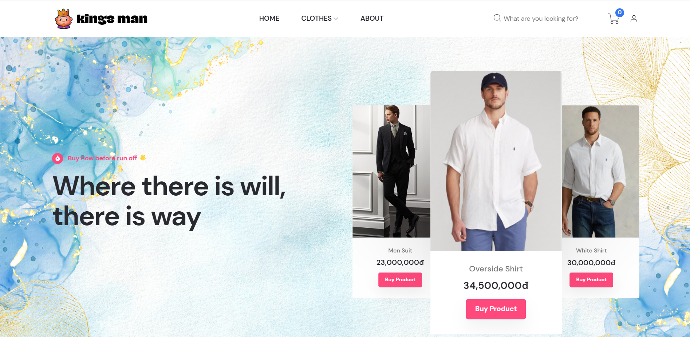
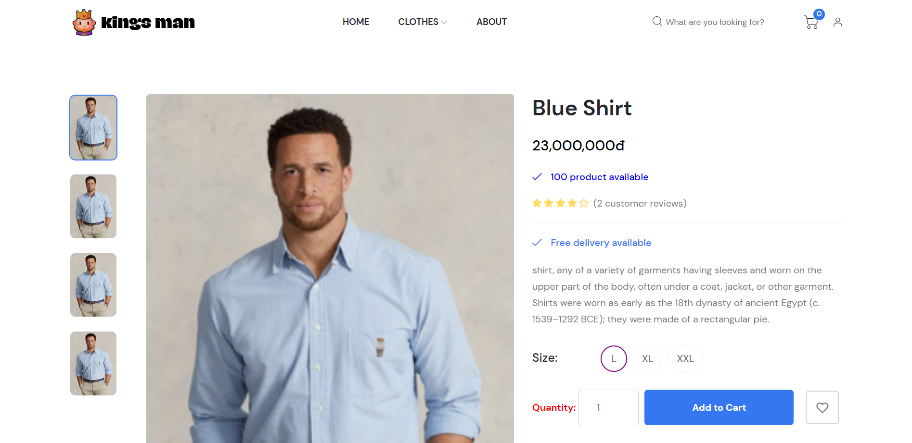
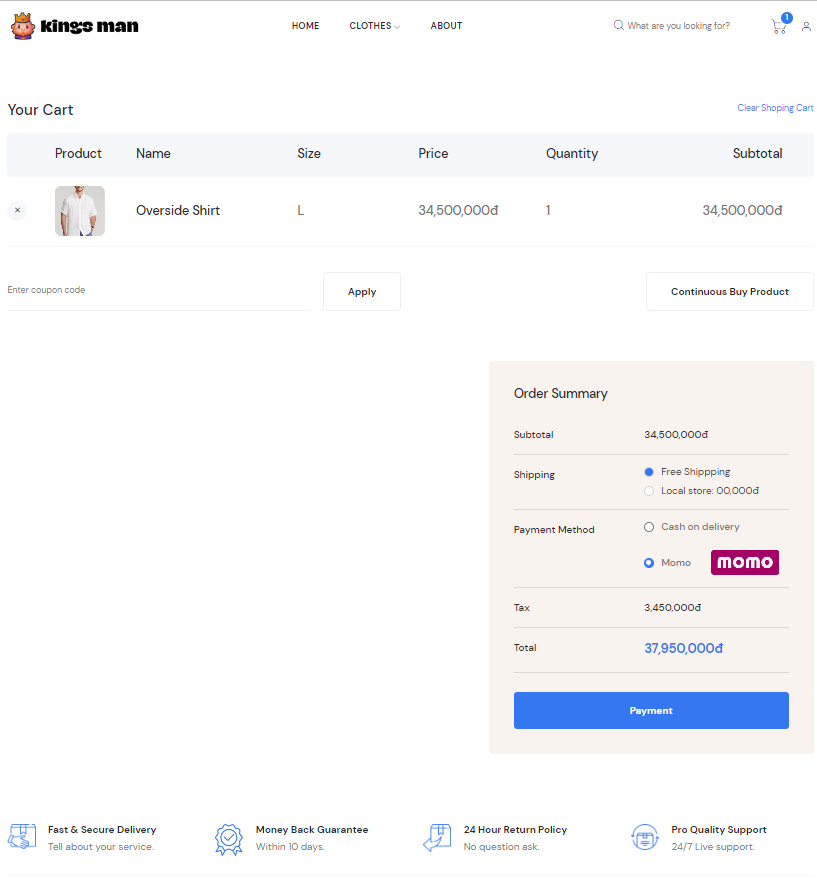
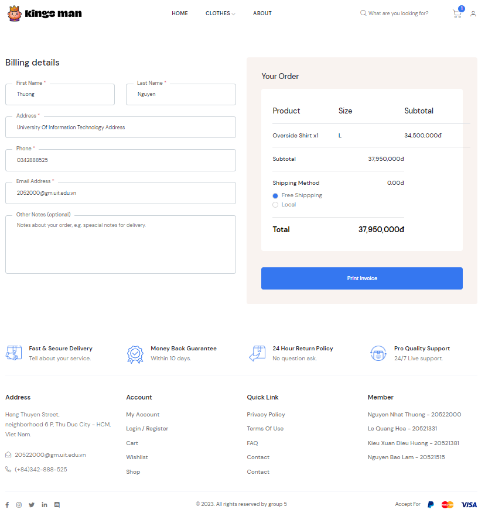
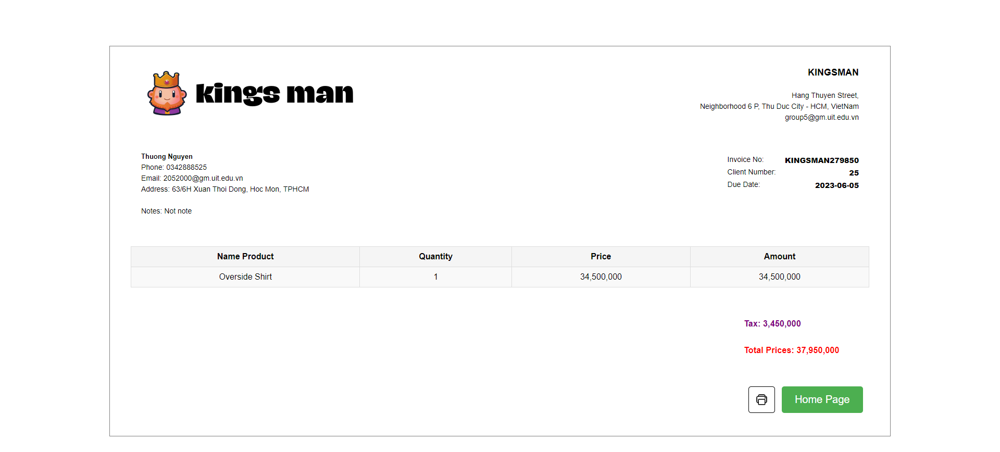
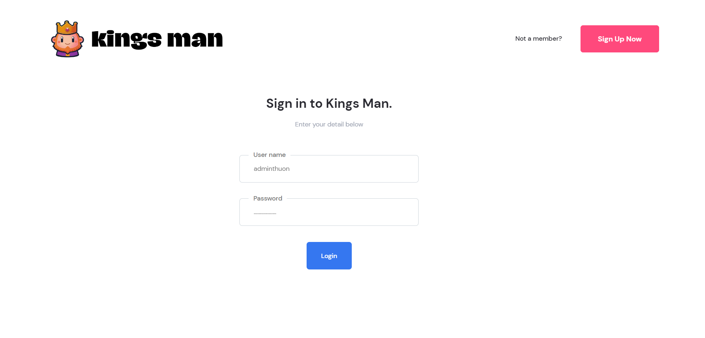
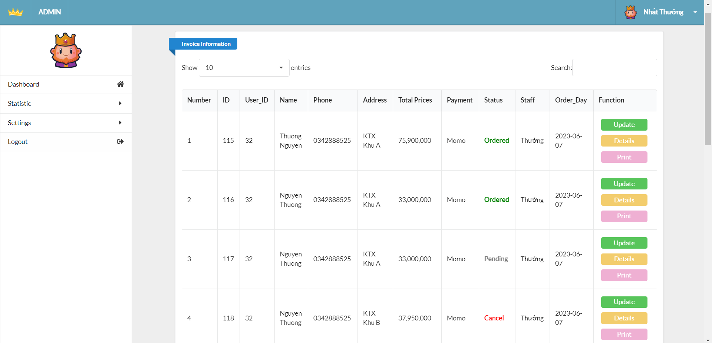
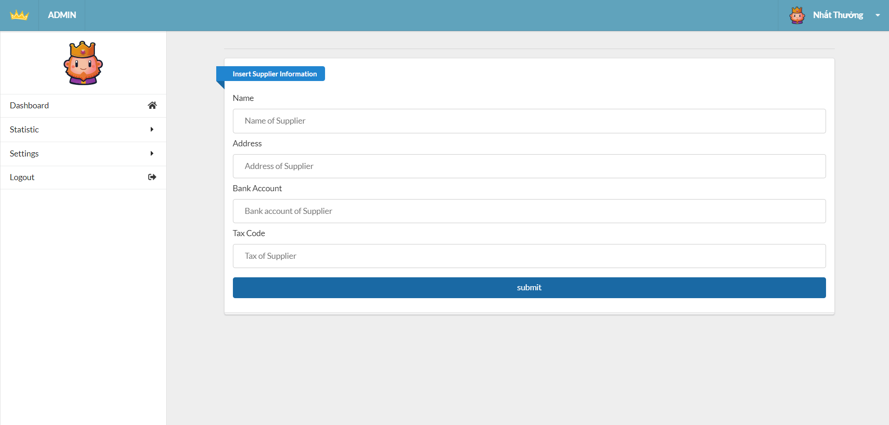
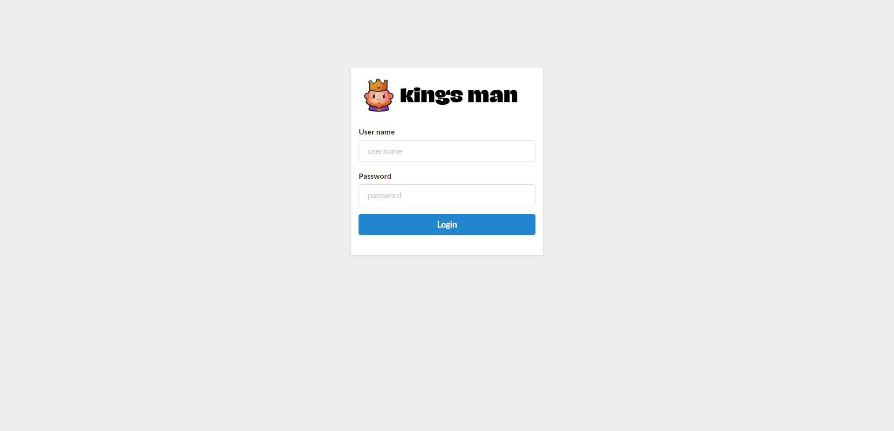

# Project: Fashion E-Commerce Website 

**Academic Project**  
**Course**: BCA 6th Semester  

## Tech Stack

- **Front-End**: HTML, CSS, JavaScript
- **Back-End**: PHP
- **Database**: MySQL
- **Development/Deployment Tools**: XAMPP (Apache + MySQL)

## How to Run the Project Locally

### Prerequisites
- Install [XAMPP](https://www.apachefriends.org/index.html)
- Git (optional, for cloning)

### Setup Steps

1. Clone the repository (or download the source code):

2. Copy the entire project folder into the `htdocs` directory of your XAMPP installation (e.g., `C:\xampp\htdocs\fashion-ecommerce-project`).

3. Start **Apache** and **MySQL** from the XAMPP Control Panel.

4. Open your browser and go to: `http://localhost/phpmyadmin`

5. Create a new database named `fashion`.

6. Import the provided SQL file:
- Locate the `database/fashion.sql` file in the project folder.
- In phpMyAdmin, select the `fashion` database → Import → Choose the SQL file → Go.

7. Access the website:
- User side: `http://localhost/fashion-ecommerce-project/` (or your folder name)
- Admin panel: `http://localhost/fashion-ecommerce-project/admin/login.php`

8. Default Login Credentials (for testing):
- **Admin**
  - Username: `admin`
  - Password: `123`

> Note: Folder paths and URLs may vary slightly depending on how you name the project folder. Adjust accordingly.

## Project Features

### User Side
- Home page with product listings
- Product details view
- Shopping cart
- Checkout & billing information
- Invoice generation
- User login/registration

### Admin Side
- Dashboard
- Product management (add, edit, delete)
- Order & invoice management
- User management

## Screenshots

### User Website
**1. Home Page**

**2. Product Details**

**3. Shopping Cart**

**4. Billing Information**

**5. Invoice Print**

**6. User Login**

### Admin Panel
**1. Admin Dashboard**

**2. Add/Edit Product**

**3. Admin Login**

> **Disclaimer**: This project is developed solely for academic and educational purposes. All content, images, and branding used are for demonstration only.
